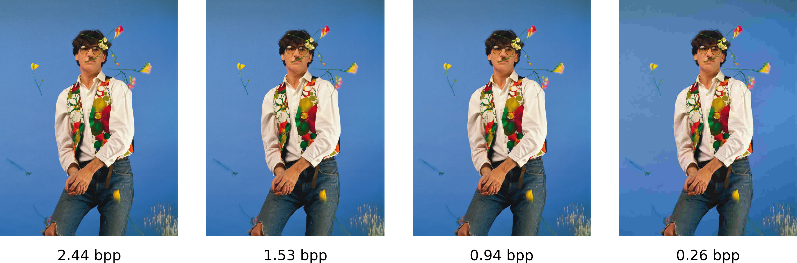

## Some lossy compression algorithms




This repo contains two compression algorithms in ```python3```:
- Color coding using huffman codes
- A custom jpeg implementation


### Color coding
To perform color coding compression use ```color_code.py```


    usage: color_code.py [-h] [--verbose] {encode,decode} path_in path_out

    positional arguments:
    {encode,decode}  encode or decode an image
    path_in          path to input
    path_out         path for saving output

    optional arguments:
    -h, --help       show this help message and exit
    --verbose        print encoding statistics

### JPEG coding
To perform jpeg compression use ```jpeg_code.py```

    usage: jpeg_code.py [-h] [--verbose] {encode,decode} ... path_in path_out

    positional arguments:
    {encode,decode}  encode or decode an image
    path_in          path to input
    path_out         path for saving output

    optional arguments:
    -h, --help       show this help message and exit
    --verbose        print encoding statistics

The JPEG encoding also allows for some optional parameters that control the level of compression.  Higher compression results in a smaller file size but may lead to noticable artifacts.

    usage: jpeg_code.py encode [-h] [--quant QUANT] [--sub_rows SUB_ROWS] [--sub_columns SUB_COLUMNS]

    optional arguments:
    -h, --help            show this help message and exit
    --quant QUANT         level of quantization applied to the image. Lower values indicate less quantization.
                            Use integers ranging from -60 to 30 for good results
    --sub_rows SUB_ROWS   chrominance subsampling in the direction of the rows
    --sub_columns SUB_COLUMNS
                            chrominance subsampling in the direction of the columns

```quant``` is the most important one. The default value is -45. You might want to try out a few quantization levels to see how much quantizaton affects your image.

## Other interesting stuff
Besides the compression algorithms, there are also a couple of interesting things connected to the [blog post](https://mgp123.github.io/2021/12/20/lossy-compression/). For example:

- Testing compression performance with [picsum](https://picsum.photos/) images
- Decomposing an image into its cosine transform components 
- Projecting an image into a random orthogonal basis (and making a nice animation with it).

